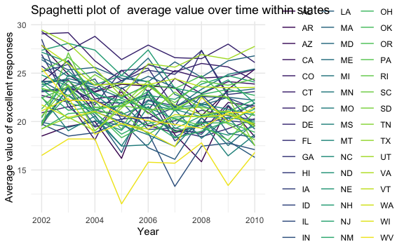
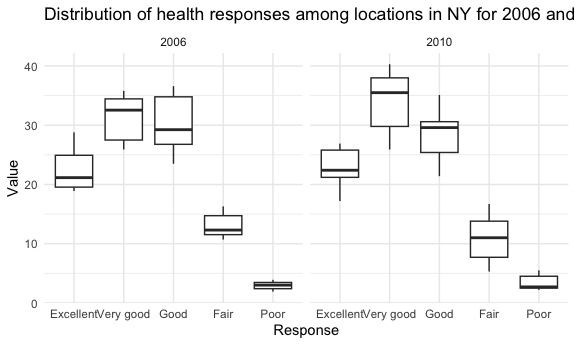

p8105_hw3_zw2974
================
Zihan Wu
2023-10-05

### Problem2

## Data cleaning:

- Format the data to use appropriate variable names;
- Focus on the “Overall Health” topic
- Include only responses from “Excellent” to “Poor”
- Organize responses as a factor taking levels ordered from “Poor” to
  “Excellent”

``` r
data("brfss_smart2010")
brfss = brfss_smart2010|> 
  janitor::clean_names() |> 
  filter(topic == "Overall Health",
         ) |> 
  mutate(response = factor(response, 
                           levels = c("Excellent", "Very good", "Good", "Fair", "Poor"),
                           order = T)
                           )
```

## Answering:

- In 2002, which states were observed at 7 or more locations? What about
  in 2010?

``` r
seven_02 =
  brfss |> 
  filter(
    year == 2002,
    response == "Excellent") |> 
  group_by(year, locationabbr) |> 
  summarize(n_county = n()) |> 
  filter(n_county >= 7) |> 
  pull(locationabbr)
```

    ## `summarise()` has grouped output by 'year'. You can override using the
    ## `.groups` argument.

``` r
seven_10 =
  brfss |> 
  filter(
    year == 2010,
    response == "Excellent") |> 
  group_by(year, locationabbr) |> 
  summarize(n_county = n()) |> 
  filter(n_county >= 7) |> 
  pull(locationabbr)
```

    ## `summarise()` has grouped output by 'year'. You can override using the
    ## `.groups` argument.

In 2002, states were observed at 7 or more locations: CT, FL, MA, NC,
NJ, PA

In 2010, states were observed at 7 or more locations: CA, CO, FL, MA,
MD, NC, NE, NJ, NY, OH, PA, SC, TX, WA

- Construct a dataset that is limited to `Excellent` responses, and
  contains, year, state, and a variable that averages the `data_value`
  across locations within a state. Make a “spaghetti” plot of this
  average value over time within a state (that is, make a plot showing a
  line for each state across years – the `geom_line` geometry and group
  aesthetic will help).

``` r
excellent = 
  brfss |> 
  filter(response == "Excellent") |> 
  group_by(year, locationabbr) |> 
  summarize(avg = mean(data_value, na.rm = T))
```

    ## `summarise()` has grouped output by 'year'. You can override using the
    ## `.groups` argument.

``` r
excellent_plot =
  ggplot(
    excellent,
    aes(x = year, y = avg, color = locationabbr, group = locationabbr)) +
  geom_line() +
  theme_minimal() +
  labs(title = "Spaghetti plot of  average value over time within states",
       x = "Year",
       y = "Average value of excellent responses")

excellent_plot
```


\* Make a two-panel plot showing, for the years 2006, and 2010,
distribution of `data_value` for responses (“Poor” to “Excellent”) among
locations in NY State.

``` r
ny_data = brfss %>%
  filter(locationabbr == "NY", year %in% c(2006, 2010))

ny_plot = ggplot(ny_data, aes(x=response, y=data_value)) +
  geom_boxplot() +
  facet_wrap(~year, scales = "free_x") +
  theme_minimal() +
  labs(title = "Distribution of health responses among locations in NY for 2006 and 2010",
       x = "Response",
       y = "Value")

print(ny_plot)
```


``` r
ny_data = brfss %>%
  filter(locationabbr == "NY", year %in% c(2006, 2010))

ny_plot = ggplot(ny_data, aes(x=response, y=data_value)) +
  geom_boxplot() +
  facet_wrap(~year, scales = "free_x") +   # This line creates two panels
  theme_minimal() +
  labs(title = "Distribution of health responses among locations in NY for 2006 and 2010",
       x = "Response",
       y = "Value")

print(ny_plot)
```


