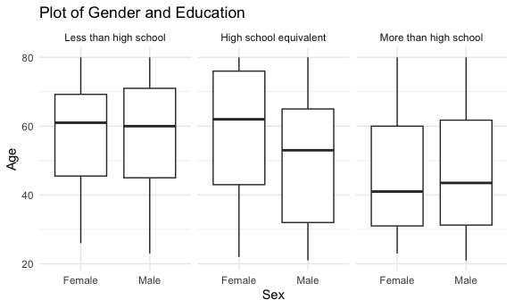
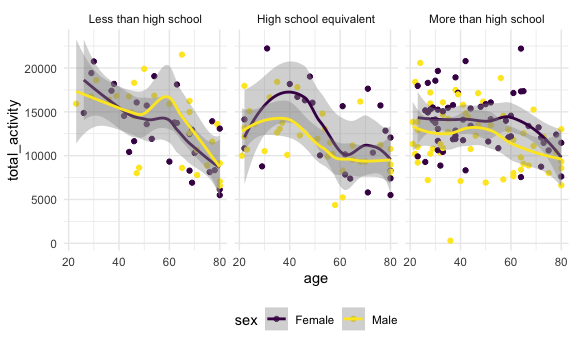
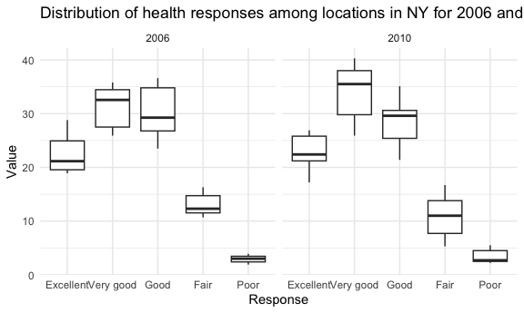

p8105_hw3_zw2974
================
Zihan Wu
2023-10-05

### Problem 2

## Data cleaning:

- Format the data to use appropriate variable names;
- Focus on the “Overall Health” topic
- Include only responses from “Excellent” to “Poor”
- Organize responses as a factor taking levels ordered from “Poor” to
  “Excellent”

``` r
data("brfss_smart2010")
brfss = brfss_smart2010|> 
  janitor::clean_names() |> 
  filter(topic == "Overall Health"
         ) |> 
  mutate(response = factor(response, 
                           levels = c("Excellent", "Very good", "Good", "Fair", "Poor"),
                           order = T)
                           )
```

## Answering:

- In 2002, which states were observed at 7 or more locations? What about
  in 2010?

``` r
seven_02 =
  brfss |> 
  filter(
    year == 2002,
    response == "Excellent") |> 
  group_by(year, locationabbr) |> 
  summarize(n_county = n()) |> 
  filter(n_county >= 7) |> 
  pull(locationabbr)
```

    ## `summarise()` has grouped output by 'year'. You can override using the
    ## `.groups` argument.

``` r
seven_10 =
  brfss |> 
  filter(
    year == 2010,
    response == "Excellent") |> 
  group_by(year, locationabbr) |> 
  summarize(n_county = n()) |> 
  filter(n_county >= 7) |> 
  pull(locationabbr)
```

    ## `summarise()` has grouped output by 'year'. You can override using the
    ## `.groups` argument.

In 2002, states were observed at 7 or more locations: CT, FL, MA, NC,
NJ, PA

In 2010, states were observed at 7 or more locations: CA, CO, FL, MA,
MD, NC, NE, NJ, NY, OH, PA, SC, TX, WA

- Construct a dataset that is limited to `Excellent` responses, and
  contains, year, state, and a variable that averages the `data_value`
  across locations within a state. Make a “spaghetti” plot of this
  average value over time within a state (that is, make a plot showing a
  line for each state across years – the `geom_line` geometry and group
  aesthetic will help).

``` r
excellent = 
  brfss |> 
  filter(response == "Excellent") |> 
  group_by(year, locationabbr) |> 
  summarize(avg = mean(data_value, na.rm = T))
```

    ## `summarise()` has grouped output by 'year'. You can override using the
    ## `.groups` argument.

``` r
excellent_plot =
  ggplot(
    excellent,
    aes(x = year, y = avg, color = locationabbr, group = locationabbr)) +
  geom_line() +
  theme_minimal() +
  labs(title = "Spaghetti plot of  average value over time within states",
       x = "Year",
       y = "Average value of excellent responses")

excellent_plot
```


\* Make a two-panel plot showing, for the years 2006, and 2010,
distribution of `data_value` for responses (“Poor” to “Excellent”) among
locations in NY State.

``` r
ny_data = brfss %>%
  filter(locationabbr == "NY", year %in% c(2006, 2010))

ny_plot = ggplot(ny_data, aes(x=response, y=data_value)) +
  geom_boxplot() +
  facet_wrap(~year, scales = "free_x") +
  theme_minimal() +
  labs(title = "Distribution of health responses among locations in NY for 2006 and 2010",
       x = "Response",
       y = "Value")

print(ny_plot)
```


``` r
ny_data = brfss %>%
  filter(locationabbr == "NY", year %in% c(2006, 2010))

ny_plot = ggplot(ny_data, aes(x=response, y=data_value)) +
  geom_boxplot() +
  facet_wrap(~year, scales = "free_x") +   # This line creates two panels
  theme_minimal() +
  labs(title = "Distribution of health responses among locations in NY for 2006 and 2010",
       x = "Response",
       y = "Value")

print(ny_plot)
```


### Problem 3

## Load, tidy, merge, and otherwise organize the data sets

``` r
accel = read_csv("data/nhanes_accel.csv") |> 
  janitor::clean_names() |> 
  pivot_longer(min1: min1440, names_to = "min", values_to = "mims")
```

    ## Rows: 250 Columns: 1441
    ## ── Column specification ────────────────────────────────────────────────────────
    ## Delimiter: ","
    ## dbl (1441): SEQN, min1, min2, min3, min4, min5, min6, min7, min8, min9, min1...
    ## 
    ## ℹ Use `spec()` to retrieve the full column specification for this data.
    ## ℹ Specify the column types or set `show_col_types = FALSE` to quiet this message.

``` r
covar = read_csv("data/nhanes_covar.csv", skip = 4) |> 
  janitor::clean_names() |> 
  filter(age >= 21) |> 
  na.omit() |> 
  mutate(
    sex = case_match(
      sex,
      1 ~ "Male",
      2 ~ "Female"
      ),
    education = case_match(
      education,
      1 ~ "Less than high school",
      2 ~ "High school equivalent",
      3 ~ "More than high school"
    ),
    education = factor(education,
                        levels = c("Less than high school",
                                   "High school equivalent",
                                   "More than high school"))) 
```

    ## Rows: 250 Columns: 5
    ## ── Column specification ────────────────────────────────────────────────────────
    ## Delimiter: ","
    ## dbl (5): SEQN, sex, age, BMI, education
    ## 
    ## ℹ Use `spec()` to retrieve the full column specification for this data.
    ## ℹ Specify the column types or set `show_col_types = FALSE` to quiet this message.

``` r
joint = inner_join(covar, accel, by = "seqn")
```

## Table

``` r
gender_df = joint |> 
  group_by(sex, education) |> 
  summarize(num_people = n()) |> 
  pivot_wider(
    names_from = "education",
    values_from = "num_people"
  ) |> 
  knitr::kable(caption="Number of Gender in Each Education Category")
```

    ## `summarise()` has grouped output by 'sex'. You can override using the `.groups`
    ## argument.

``` r
gender_df
```

| sex    | Less than high school | High school equivalent | More than high school |
|:-------|----------------------:|-----------------------:|----------------------:|
| Female |                 40320 |                  33120 |                 84960 |
| Male   |                 38880 |                  50400 |                 80640 |

Number of Gender in Each Education Category

In the table, it’s clear to discern that `More than high school`
contains most number of people. For female, more people are in the
category `less than high school` while for male, more people are in the
category `high school equivalent`.

## Plot

``` r
gender_plot = joint |> 
  ggplot(aes(x = sex, y = age)) +
  geom_boxplot() +
  facet_wrap(~education) +
  labs(
    title = "Plot of Gender and Education",
    x = "Sex",
    y = "Age"
  )
gender_plot
```



From the plot above, we can clearly discover that for the category
`Less than high school` and `More than high school` have similar
distribution. Nevertheless, for the `High school equivalent`, the mean
age is much higher for female(over 60 comparing to around 50 for male).

## Accelerometer data

``` r
accel_df = joint |> 
  group_by(seqn, sex, age, education) |> 
  summarize(
    total_activity = sum(mims)
  ) |> 
  ggplot(
    aes(x = age, y = total_activity, color = sex)
  ) +
  geom_point() +
  geom_smooth() +
  facet_wrap(~education)
```

    ## `summarise()` has grouped output by 'seqn', 'sex', 'age'. You can override
    ## using the `.groups` argument.

``` r
accel_df
```

    ## `geom_smooth()` using method = 'loess' and formula = 'y ~ x'



``` r
# Aggregate data
activity_by_time = joint %>% 
  group_by(min, education, sex) %>% 
  summarize(avg_activity = mean(mims, na.rm = TRUE))
```

    ## `summarise()` has grouped output by 'min', 'education'. You can override using
    ## the `.groups` argument.

``` r
# Plot
time_course_plot = ggplot(activity_by_time, aes(x = as.numeric(str_replace(min, "min", "")), y = avg_activity, color = sex)) +
  geom_line() +
  facet_wrap(~education, scales = "free_y") +
  labs(title = "24-hour Activity Time Course by Education Level",
       x = "Minute of the Day (from Midnight)",
       y = "Average Activity (MIMS)") +
  theme_minimal() +
  scale_color_manual(values = c("Male" = "blue", "Female" = "red"))

print(time_course_plot)
```


